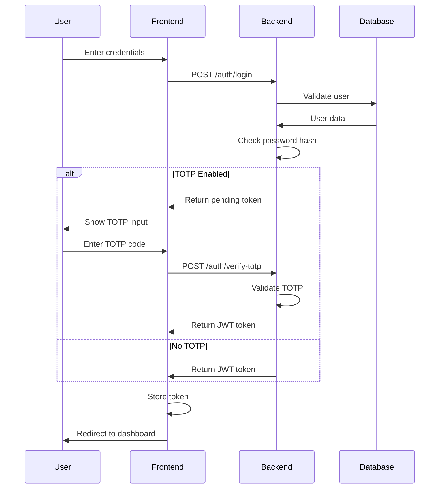
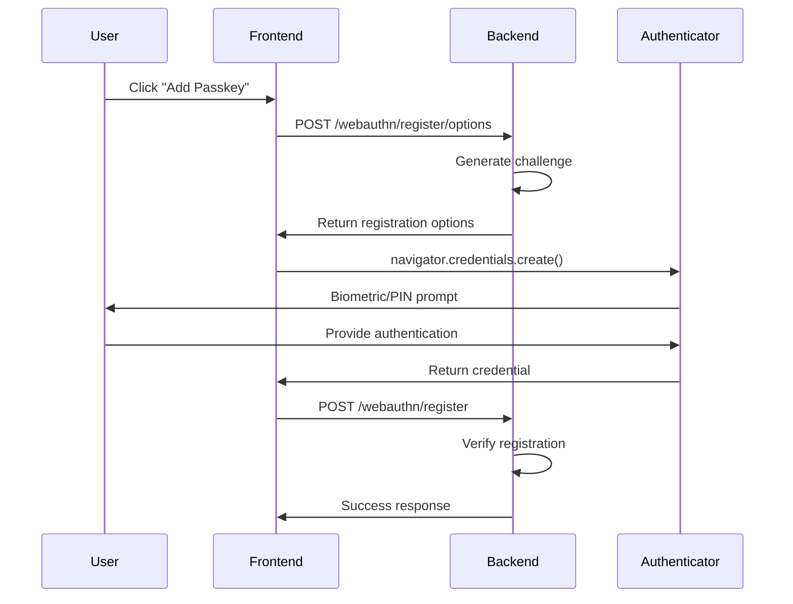
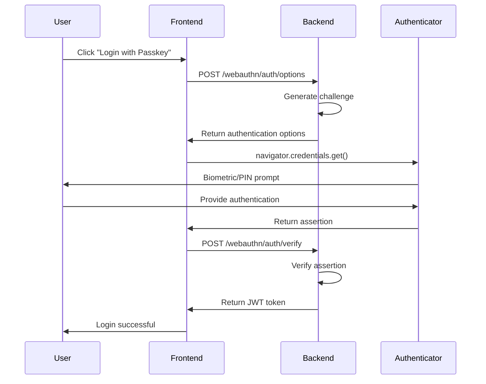

# Security Guide

This document explains the security architecture and authentication flows implemented in the Auth Levels project.

## 🔒 Security Architecture

### Authentication Methods

The system supports three primary authentication methods:

1. **JWT-based Authentication** - Traditional username/password with JWT tokens
2. **TOTP (Time-based One-Time Password)** - 2FA using authenticator apps
3. **WebAuthn/Passkeys** - Modern biometric and hardware key authentication

### Security Principles

- **Defense in Depth** - Multiple layers of security
- **Principle of Least Privilege** - Users only get necessary permissions
- **Zero Trust** - All requests are authenticated and authorized
- **Secure by Default** - Safe configurations out of the box

## 🔐 Authentication Flows

### 1. Standard Login Flow



### 2. WebAuthn Registration Flow



### 3. WebAuthn Login Flow



## 🛡️ Security Features

### Password Security

- **BCrypt Hashing** - Industry-standard password hashing
- **Salt Generation** - Unique salt per password
- **Configurable Rounds** - Adjustable work factor
- **No Plain Text Storage** - Passwords never stored in plain text

### JWT Token Security

- **Short Expiration** - Tokens expire in reasonable timeframes
- **Secure Storage** - Stored in httpOnly cookies (recommended) or localStorage
- **Signature Verification** - All tokens cryptographically signed
- **Claims Validation** - Issuer, audience, and expiration checked

### TOTP Security

- **RFC 6238 Compliant** - Standard TOTP implementation
- **Secure Secret Generation** - Cryptographically random secrets
- **Backup Codes** - Alternative recovery method
- **Time Window Tolerance** - Accounts for clock skew

### WebAuthn Security

- **Public Key Cryptography** - No shared secrets
- **Origin Validation** - Prevents phishing attacks
- **Attestation Verification** - Validates authenticator legitimacy
- **User Verification** - Biometric or PIN confirmation
- **Replay Attack Prevention** - Signature counter tracking

## 🔍 Security Controls

### Input Validation

```java
// Example validation in DTOs
@Valid
@Email(message = "Invalid email format")
private String email;

@NotBlank(message = "Password cannot be blank")
@Size(min = 8, message = "Password must be at least 8 characters")
private String password;
```

### CORS Configuration

```java
@Configuration
public class SecurityConfig {

    @Bean
    public CorsConfigurationSource corsConfigurationSource() {
        CorsConfiguration configuration = new CorsConfiguration();
        configuration.setAllowedOriginPatterns(Arrays.asList("http://localhost:3000"));
        configuration.setAllowedMethods(Arrays.asList("GET", "POST", "PUT", "DELETE"));
        configuration.setAllowedHeaders(Arrays.asList("*"));
        configuration.setAllowCredentials(true);
        return source;
    }
}
```

### API Rate Limiting

Consider implementing rate limiting for production:

```java
// Example rate limiting configuration
@Component
public class RateLimitingFilter implements Filter {

    private final RateLimiter rateLimiter = RateLimiter.create(10.0); // 10 requests per second

    @Override
    public void doFilter(ServletRequest request, ServletResponse response, FilterChain chain) {
        if (rateLimiter.tryAcquire()) {
            chain.doFilter(request, response);
        } else {
            ((HttpServletResponse) response).setStatus(429); // Too Many Requests
        }
    }
}
```

## ⚠️ Security Considerations

### Development vs Production

#### Development Settings

- Database schema auto-creation
- Detailed error messages
- CORS allows localhost
- HTTP allowed for localhost

#### Production Requirements

- **HTTPS Only** - Required for WebAuthn
- **Secure Headers** - HSTS, CSP, X-Frame-Options
- **Environment Variables** - Secure secret management
- **Database Security** - Connection encryption, limited privileges
- **Error Handling** - Generic error messages
- **Logging** - Security event logging

### Common Vulnerabilities Mitigated

#### OWASP Top 10 Coverage

1. **Injection** - Prepared statements, input validation
2. **Broken Authentication** - Strong password policies, MFA
3. **Sensitive Data Exposure** - Encryption at rest and in transit
4. **XML External Entities** - Not applicable (no XML processing)
5. **Broken Access Control** - JWT validation, authorization checks
6. **Security Misconfiguration** - Secure defaults, configuration review
7. **Cross-Site Scripting** - Input sanitization, CSP headers
8. **Insecure Deserialization** - Careful JSON processing
9. **Using Components with Known Vulnerabilities** - Dependency scanning
10. **Insufficient Logging & Monitoring** - Security event logging

### WebAuthn Specific Security

#### Relying Party Configuration

```java
@Bean
public RelyingParty relyingParty() {
    return RelyingParty.builder()
        .identity(RelyingPartyIdentity.builder()
            .id("localhost")  // Change for production
            .name("Auth Levels")
            .build())
        .credentialRepository(databaseCredentialRepository)
        .allowOriginPort(true)  // Remove for production
        .build();
}
```

#### Production WebAuthn Checklist

- [ ] Set correct relying party ID (domain)
- [ ] Configure proper origins
- [ ] Disable `allowOriginPort` for production
- [ ] Implement proper attestation validation
- [ ] Set up HTTPS with valid certificates
- [ ] Configure user verification requirements

## 🚨 Incident Response

### Security Monitoring

Monitor for these security events:

- Failed login attempts
- TOTP verification failures
- WebAuthn registration/authentication failures
- JWT token validation errors
- Unusual access patterns

### Emergency Procedures

1. **Compromised User Account**

   - Invalidate all user JWT tokens
   - Force password reset
   - Disable compromised credentials
   - Audit access logs

2. **System Compromise**

   - Rotate JWT signing keys
   - Force all users to re-authenticate
   - Audit database for unauthorized changes
   - Review access logs

3. **WebAuthn Issues**
   - Disable WebAuthn temporarily
   - Provide alternative authentication
   - Investigate credential repository

## 📋 Security Checklist

### Pre-Production Security Review

- [ ] Change default database credentials
- [ ] Set secure JWT secrets
- [ ] Enable HTTPS/TLS
- [ ] Configure security headers
- [ ] Review CORS settings
- [ ] Enable audit logging
- [ ] Set up monitoring
- [ ] Scan dependencies for vulnerabilities
- [ ] Conduct penetration testing
- [ ] Review error messages for information disclosure
- [ ] Validate input sanitization
- [ ] Test rate limiting
- [ ] Verify WebAuthn domain configuration
- [ ] Review database permissions
- [ ] Configure backup and recovery procedures
